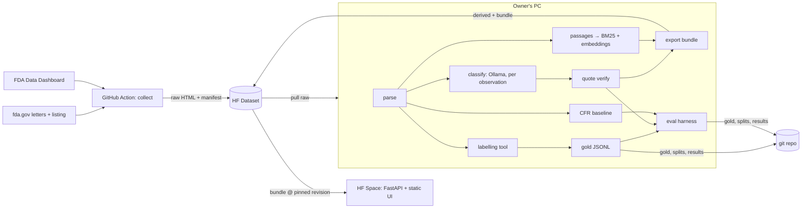

# 0001: System architecture for RegIntel v2

- Status: proposed
- Date: 2026-09-27

## Context

`docs/vision.md` requires $0/month, a local 7–8B model on an 8 GB GPU, a public FastAPI site on a free HF CPU Space, and an evaluation that holds up to scrutiny: blind gold labels, a frozen test run, and metrics that trace to files. v1 failed on measurement, not on features. So the architecture is built around traceability and around guards that make protocol violations hard to commit by accident.

## Decision

### Where things run

| Place | Does | Never does |
|---|---|---|
| GitHub Actions (weekly cron plus manual dispatch) | Fetches the FDA listing, new or changed letter HTML and the Data Dashboard citation export. Appends to `manifest.jsonl` (`letter_id`, URL, `retrieved_at`, `sha256`, listing fields including close-out). Pushes `raw/` to the HF Dataset. | Parse, call a model, touch derived data |
| Owner's PC (RTX 4060) | Parse → baseline → classify (Ollama) → embed → build index → export bundle. Pushes `derived/` and `bundle/`. Runs the labelling tool and the evaluation. | Serve the public site |
| HF Docker Space (free CPU) | Pulls `bundle/<id>` at the pinned `BUNDLE_REVISION` at startup. Serves the FastAPI API and the static HTML/CSS/JS. Embeds the query at request time with a model baked into the image. | Classify, parse, write data |

### Where data lives: HF Dataset for bulk data, git for evidence

| | Git only | HF Dataset (bulk) + git (evidence), **chosen** |
|---|---|---|
| Size | ~100 MB of raw HTML, plus ~45 MB of binary index per rebuild, kept forever in history | The dataset has its own history and quotas. The git repo stays small. |
| Writers | Action and PC both commit to one branch, which risks conflicts | Action writes only `raw/` and the PC writes only `derived/` and `bundle/`, so their paths are disjoint |
| Deploy | The Space rebuilds the image for every data change | The Space pulls a pinned revision, and changing the data is an env-var bump |
| Audit | Everything sits in one history | Results record the dataset revision, and evidence files are reviewed in PRs |

Dataset layout (append-only; content-addressed where possible):
- `raw/letters/<letter_id>/<sha256>.html`
- `raw/manifest.jsonl`
- `raw/dashboard/<date>.csv`
- `derived/parsed/<parser_version>/<letter_id>.json`
- `derived/runs/<run_id>/{run.json,predictions.jsonl}`
- `bundle/<bundle_id>/`

When a letter changes upstream, it gets a new hash file and a new manifest line. Nothing is overwritten.

Git holds the reviewable evidence:
- `reference/cfr_map.csv` (frozen with the guide)
- `evaluation/splits/` (sample, dev, test and relabel ID lists with sha256)
- `evaluation/gold/` (labels and relabels JSONL)
- `evaluation/search/questions.jsonl`
- `evaluation/runs/<run_id>/` (`run.json` plus the predictions for the 150 sampled letters)
- `evaluation/results/`
- freeze records in `docs/decisions/`

### Parsing

**Normalisation.** One function, `text.normalise`, applies NFKC, then folds curly quotes and prime marks to `'`/`"` and every dash and hyphen variant to `-`, then collapses whitespace to single spaces. It is used identically for letter text, gold quotes and model quotes. Its source hash is part of `config_hash`, so it is fixed from the freeze onwards.

**Canonical text.** The letter body is extracted from the fda.gov page chrome and passed through `normalise`. All offsets, quotes and highlights refer to this text.

Observations are found by year-tolerant rules (numbered paragraphs inside the violations section) and stored as `(n, start, end)`. If no numbering is found, the violations section becomes one unit flagged `segmentation: fallback`, and the fallback count is reported. Compounding letters often use bullets.

**Label scope.** Only the cited violations (the observation spans) can carry labels. FDA's standard remediation sections are tagged `remediation` and excluded from labelling. An example is the data-integrity remediation requests. These sections stay searchable. The same rule goes into `docs/labelling-guide.md` for gold.

Metadata:
- firm, letter date, and FEI (regex, nullable)
- `facility_description`: the product and facility description from the opening paragraph, truncated to a fixed length
- subject line, with `letter_type` taken from an ordered rule table. An unmatched subject gives `unknown` and fails loudly in the parse report, rather than a guess.
- close-out status and date, from the listing

`parser_version` is part of every derived path.

### Classification

- **Unit.** One Ollama call per observation, using schema-constrained JSON (`{"labels":[{"category":<enum 1–13>,"quote":str}]}`). The input is a short letter header (subject, `letter_type`, `facility_description`) followed by the observation text. The header is context only. The prompt embeds the category definitions from `docs/labelling-guide.md`.
- **Settings.** Temperature 0, fixed seed, fixed `num_ctx`.
- **Letter labels.** The union of the observation labels, keeping every verified quote.
- **Quote check.** `normalise(quote)` must be an exact substring of the canonical letter text, and must fall inside an observation span. Quotes from the header or from remediation sections are therefore out of scope. Its offsets are stored. A failed quote drops that label, and the drop is counted per category in `run.json`. The drop rate is reported on dev and on test.
- **Skipped letters.** Unapproved/misbranding-only letters are not classified.

Guards:
- **Sample guard (per letter).** Until the gold file holds all 150, every step that produces or shows scored outputs refuses the 150 sample letter IDs: `classify`, `baseline`, eval scoring and bundle export. Letters outside the sample may be classified from the walking skeleton onwards.
- Classifying any test letter is refused without a matching freeze record.
- As a result, test letters appear on the site as *not yet classified* until Day 6.

### Traceability

Every `run.json` records:
- model name and Ollama digest
- prompt template sha256, labelling-guide sha256 and `normalise` source sha256
- settings (temperature, seed, `num_ctx`, schema hash)
- `config_hash`, the sha256 of all of the above
- git commit and dirty flag (a dirty tree is refused for eval runs)
- `parser_version`, dataset revision, timestamps and quote-drop counts

Results files cite `run_id`, split hashes and the gold file hash. Every number in the README is rendered from `evaluation/results/*.json` by a script, and a test fails if the README and the results disagree.

### Evaluation harness

- **Splits.** Sample 150 with a fixed seed, stratified by FY × letter type, then split 50/100 on the same strata. The 20 re-labels are seeded and drawn from **test only** (see Consequences). Each split file stores its own sha256.
- **Baseline.** Extract 21 CFR, FD&C and Q7 references, then map them through `cfr_map.csv`. A citation can map to several categories.
- **Metrics.**
  - per category: P/R/F1 and support, with a 95% bootstrap CI
  - micro and macro averages
  - a paired bootstrap (10,000 resamples, fixed seed) for macro-F1 (model − baseline) and for model micro-F1
  - fewer than 5 test positives gives *insufficient support*, and the category is excluded from macro
  - every figure also reported by letter type
  - per-category κ from the re-labels; κ < 0.6 flags a category *ill-defined*
- **Freeze guard.** `score --split test` is refused unless all of these hold:
  - a `docs/decisions/NNNN-test-freeze.md` record exists whose fenced YAML block gives `config_hash`, commit and test-split hash
  - the run matches all three
  - the record was committed before the run started
  - `evaluation/results/test/` does not exist yet, so the test set is scored once

### Labelling tool (local Streamlit)

The no-Streamlit convention applies to the public site. This tool is local only.

- **Screen.** It shows the canonical text with observations split out and remediation sections greyed, 13 checkboxes, and a quote field per ticked category. Saving is refused unless every quote passes the same check as the model's quotes (`normalise`, inside an observation span).
- **Output.** It appends `{letter_id, categories, quotes{cat: str}, labelled_at, guide_sha}` to JSONL.
- **Blind by construction.** The `label` package may import only `parse` and `store`. An AST test fails on any import of `classify`, `baseline` or `eval`, or any path under `runs/`.
- **Re-label mode.** It works from `relabels.jsonl`, never reads `labels.jsonl`, and refuses any letter first labelled less than 3 days earlier.
- **Timing.** A per-letter timer supports the 6-minute pace check.

### Search

- **Passages.** Observations, plus paragraph chunks of the other sections, each with `(letter_id, start, end)`.
- **Retrieval.** BM25 (`bm25s`) plus `bge-small-en-v1.5` through `fastembed` (ONNX). The same library encodes documents on the PC and queries on the Space.
- **Ranking.** Brute-force cosine in numpy, which is enough for under 50k vectors, then RRF with k = 60, untuned.
- **Bundle.** `letters.jsonl`, `passages.jsonl`, the `bm25/` directory, `embeddings.npy` (float16), `trends.json`, and `bundle.json` (hashes, run IDs, *classified up to*).
- **Evaluation.** There are 40 questions, written before retrieval exists. Recall@5 is measured for hybrid, BM25-only and embedding-only. Citation validity requires every highlight's offsets to slice exactly its text and every link to resolve.

### Module layout and testing

| Package (`src/regintel/`) | Contents | Tests |
|---|---|---|
| `collect/` | listing, fetch (rate-limited, retried, cached), manifest, dashboard | Recorded HTTP responses (`respx`); manifest append-only and unique-hash properties |
| `parse/` | `text.normalise`, html→canonical text, observations, remediation tagging, metadata, `letter_type` rules | **Real letter HTML fixtures**, at least one per FY 2019–2026 and per letter type, each with golden JSON. Properties: spans slice exactly, are ordered and non-overlapping. A table test for subject → type. Normalisation cases (curly quotes, en/em dashes, NBSP, ligatures). |
| `baseline/` | citation extraction, frozen mapping | Fixture texts → expected categories; a test that pins the mapping hash |
| `classify/` | prompt, Ollama client, quote verify, run record | A fake client with canned JSON; quote-verify edge cases; `config_hash` determinism; guard refusals |
| `label/` | Streamlit app, label store | Store round-trip; quote refusal; the import-boundary test; re-label blindness |
| `eval/` | splits, metrics, bootstrap, κ, freeze guard, search eval | Hand-computed metric fixtures; seeded bootstrap golden; each freeze-guard refusal path |
| `index/` | passages, BM25, embed, RRF, bundle export | A tiny corpus with golden rankings; RRF arithmetic; bundle round-trip |
| `serve/` | FastAPI app, `static/` | `TestClient` against a fixture bundle; disclaimer and *classified up to* are present |
| `trends/`, `store/` | FY bucketing and aggregation; HF Dataset I/O and paths | FY boundary dates (30 Sep / 1 Oct); a mocked hub client |

Each environment installs only its own dependency group. Actions gets `collect`, the Space gets `serve`, and the PC gets everything. Tests never touch the network.

## Alternatives considered

- **Parse inside the Action** (the vision's original plan): rejected. Parsing in one place keeps `parser_version` single-sourced and keeps the Action dependency-light. The cost is that new letters become searchable only after a PC run.
- **Git or Git LFS for all data**: rejected, for the reasons in the table above. **Baking the bundle into the image** (the vision's original plan): rejected, because every data refresh would need an image rebuild.
- **Classifying the whole letter**: rejected. Long letters overflow `num_ctx` on 8 GB, and quotes are less local.
- **Hosted LLM or embedding APIs**: rejected on cost. **`sentence-transformers` + torch on the Space**: rejected for image size and cold start.
- **A vector DB (FAISS, Chroma, Qdrant) or SQLite FTS5**: rejected as unneeded at this scale. Flat files are diffable and hashable.
- **Label Studio or a spreadsheet for labelling**: rejected. Neither enforces verbatim quotes or blindness, and Label Studio is heavy to set up.
- **Gradio or Streamlit for the public site**: rejected by project convention.

## Consequences

- Protocol breaches (outputs on sample letters before gold is complete, early test scoring, scoring twice) fail in code, not just in process.
- Blindness is per letter. The owner may see model output on non-sample letters while labelling is still going on. That priming risk is recorded as a limitation in the vision.
- The weekly Action alone does not update the site. The site shows the bundle date, and freshness depends on PC runs.
- The Action needs an HF write token as a GitHub secret. The fda.gov bot protection may block runner IPs. A manually dispatched probe Action on Day 1 detects this early, and the manual collect script stays as a fallback (cut item 3).
- **Amendments applied to `docs/vision.md` (same PR):**
  - Actions collects only.
  - The bundle is pulled rather than baked into the image.
  - Re-labels are drawn from test only, because dev outputs are viewed during prompt development, which would unblind dev re-labels.
